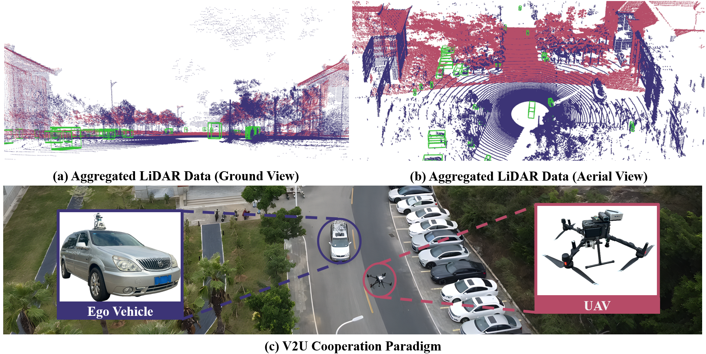

<p align="center">
  <h1 align="center">V2U4Real: A Real-world Large-scale Dataset for Vehicle-to-UAV Cooperative Perception</h1>
  <p align="center">
    <a href="https://scholar.google.com/citations?user=lrF4Nx8AAAAJ&hl=zh-CN">Weijia Li</a>,
    <a href="https://github.com/VjiaLi/V2U4Real">Haoen Xiang</a>,
    <a href="https://github.com/VjiaLi/V2U4Real">Tianxu Wang</a>,
    <a href="https://github.com/VjiaLi/V2U4Real">Shuaibing Wu</a>,
    <a href="https://scholar.google.com/citations?user=A6spPv_n5qUC&hl=zh-CN&oi=sra">Qiming Xia</a>,
    <a href="https://scholar.google.com/citations?user=kAnv3SkAAAAJ&hl=zh-CN">Cheng Wang</a>,
    <a href="https://scholar.google.com/citations?user=JOoZUmUAAAAJ&hl=zh-CN&oi=sra">Chenglu Wen</a>
  </p>
</p>

<p align="center">
  <strong>CVPR 2026</strong>
</p>

<div align="center">
  
</div>

<p align="center">
  <a href="https://arxiv.org/abs/2603.25275">
    
  </a>
  <a href="https://github.com/VjiaLi/V2U4Real">
    
  </a>
  <a href="https://github.com/VjiaLi/V2U4Real">
    
  </a>
  <a href="#citation">
    
  </a>
  <a href="https://opensource.org/license/MIT">
    
  </a>
</p>

## Dataset Demo
<div align="center">
  
  
</div>

## News

- **[2026.02]** V2U4Real is accepted to **CVPR 2026**:boom::boom::boom:.
- **[2026.04]** Codebase will be released.
- **[2026.06]** Dataset download links will be released.

> All dataset files will be released after the conference. More stars ⭐ on this repository will help accelerate the release.


## TODO

- [ ] Release training and inference code
- [ ] Release dataset download links
- [ ] Release pretrained models
- [ ] Release detailed documentation
- [ ] Release benchmark leaderboard

## Installation
### 1. Clone the repository

```bash
git clone https://github.com/VjiaLi/V2U4Real.git
cd V2U4Real
```
### 2. Create the environment
We recommend using Conda:
```sh
conda env create -f environment.yml
conda activate v2u4real
python setup.py develop
```

If Conda installation fails, you can install the dependencies with pip instead:
```sh
pip install -r requirements.txt
python setup.py develop
```

### 3. Pytorch Installation (>=1.8, tested on 1.8-1.12.0)
Go to https://pytorch.org/ to install pytorch cuda version.

### 4. Install Spconv
```bash
pip install spconv-cu113
```
#### Notes for installing spconv 1.2.1:
1. Make sure your cmake version >= 3.13.2
2. CUDNN and CUDA runtime library (use `nvcc --version` to check) needs to be installed on your machine.


### 4. Compile CUDA ops for 3D box IoU / NMS
  
  ```bash
  python opencood/utils/setup.py build_ext --inplace
  ```

## Data Download
Please check our [website]('https://github.com/VjiaLi/V2U4Real') to download the data.

After downloading the data, please put the data in the following structure:
```shell
├── V2U4Real
│   ├── train
|       |── 2025-07-17-16-12_1
|       |   |──1  # Vehicle Side
|       |   |  |── camera
|       |   |  |   |── left     # left camera images
|       |   |  |   |   |── 000001.jpg
|       |   |  |   |── middle   # center camera images
|       |   |  |   |   |── 000001.jpg
|       |   |  |   |── right    # right camera images
|       |   |  |   |   |── 000001.jpg
|       |   |  |── ouster       # OS-128 LiDAR point clouds
|       |   |  |   |── 000001.pcd
|       |   |  |── ruby         # RS-128 LiDAR point clouds
|       |   |  |   |── 000001.pcd
|       |   |  |── m1           # M1-PLUS LiDAR point clouds
|       |   |  |   |── 000001.pcd
|       |   |  |── yaml         # metadata for each timestamp
|       |   |  |   |── ouster
|       |   |  |   |   |── 000001.yaml
|       |   |  |   |── ruby
|       |   |  |   |   |── 000001.yaml
|       |   |  |   |── m1
|       |   |  |   |   |── 000001.yaml
|       |   |──2  # UAV Side
|       |   |  |── camera       # downward camera images
|       |   |  |   |── 000001.jpg
|       |   |  |── ouster       # OS-128 LiDAR point clouds
|       |   |  |   |── 000001.pcd
|       |   |  |── yaml         # metadata for each timestamp
|       |   |  |   |── ouster
|       |   |  |   |   |── 000001.yaml
|       |── 2025-07-17-16-12_2
│   ├── val
│   ├── test
```

## Quick Start
### Data sequence visualization
To quickly visualize the LiDAR stream in the V2U4Real dataset, first modify the `validate_dir`
in your `opencood/hypes_yaml/visualization.yaml` to the v2u4real data path on your local machine, e.g. `v2u4real/val`,
and the run the following commond:
```python
cd ~/V2U4Real
python opencood/visualization/vis_data_sequence.py [--color_mode ${COLOR_RENDERING_MODE}]
```
Arguments Explanation:
- `color_mode` : str type, indicating the lidar color rendering mode. You can choose from 'constant', 'intensity' or 'z-value'.


### Train your model
V2U4Real uses yaml file to configure all the parameters for training. To train your own model
from scratch or a continued checkpoint, run the following commonds:
```python
python opencood/tools/train.py --hypes_yaml ${CONFIG_FILE} [--model_dir  ${CHECKPOINT_FOLDER} --half]
```
Arguments Explanation:
- `hypes_yaml`: the path of the training configuration file, e.g. `opencood/hypes_yaml/pointpillar_early_fusion.yaml`, meaning you want to train
an early fusion model which utilizes Pointpillar as the backbone.
- `model_dir` (optional) : the path of the checkpoints. This is used to fine-tune the trained models. When the `model_dir` is
given, the trainer will discard the `hypes_yaml` and load the `config.yaml` in the checkpoint folder.
- `half` (optional): If set, the model will be trained with half precision. It cannot be set with multi-gpu training togetger.

To train on **multiple gpus**, run the following command:
```
CUDA_VISIBLE_DEVICES=0,1,2,3 python -m torch.distributed.launch --nproc_per_node=4  --use_env opencood/tools/train.py --hypes_yaml ${CONFIG_FILE} [--model_dir  ${CHECKPOINT_FOLDER}]
```


### Test the model
Before you run the following command, first make sure the `validation_dir` in config.yaml under your checkpoint folder
refers to the testing dataset path, e.g. `v2u4real/test`.

```python
python opencood/tools/inference.py --model_dir ${CHECKPOINT_FOLDER} --fusion_method ${FUSION_STRATEGY} [--show_vis] [--show_sequence]
```
Arguments Explanation:
- `model_dir`: the path to your saved model.
- `fusion_method`: indicate the fusion strategy, currently support 'early', 'late', and 'intermediate'.
- `show_vis`: whether to visualize the detection overlay with point cloud.
- `show_sequence` : the detection results will visualized in a video stream. It can NOT be set with `show_vis` at the same time.

The evaluation results  will be dumped in the model directory. 

## Benchmark and Model Zoo
Benchmark results and pretrained models will be released soon.

## Citation
If you find this dataset or code useful in your research, please consider citing our paper.
```bash
@article{li2026v2u4real,
  title={V2U4Real: A Real-world Large-scale Dataset for Vehicle-to-UAV Cooperative Perception},
  author={Li, Weijia and Xiang, Haoen and Wang, Tianxu and Wu, Shuaibing and Xia, Qiming and Wang, Cheng and Wen, Chenglu},
  journal={arXiv preprint arXiv:2603.25275},
  year={2026}
}
```

## Acknowledgements
Thank for the excellent cooperative perception dataset [OPV2V](https://mobility-lab.seas.ucla.edu/opv2v/) and [V2V4Real](https://github.com/ucla-mobility/V2V4Real).

Thank for the dataset and code support by [DerrickXu](https://github.com/DerrickXuNu).